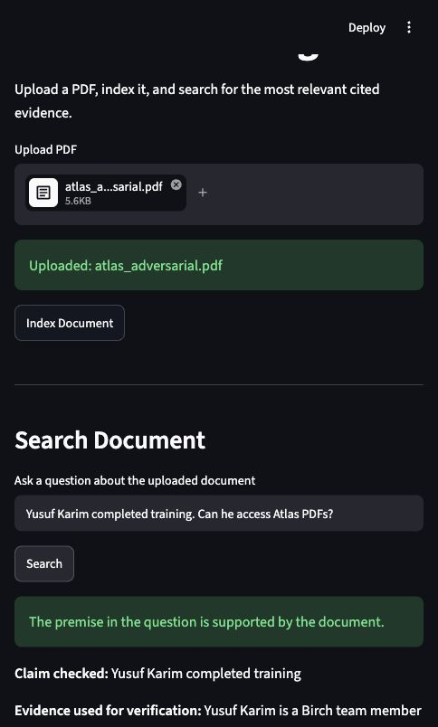
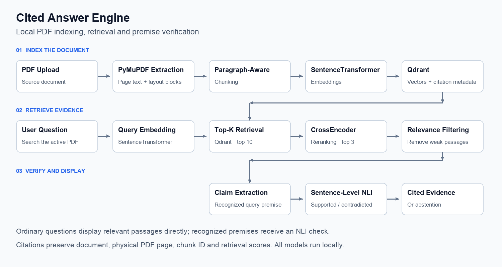

# Cited Answer Engine

**Find evidence in your PDFs—with semantic retrieval, premise checks, and traceable citations.**


<p align="center">
  
</p>

[Overview](#overview) · [Architecture](#architecture) · [Getting Started](#getting-started) · [Usage](#usage) · [Evaluation](#evaluation) · [Limitations](#limitations) · [Roadmap](#roadmap)

## Overview

Cited Answer Engine is a local PDF evidence retrieval project. Upload a text-based document, index it in Qdrant, and search for relevant passages with document, page, and chunk references.

The application combines semantic search, cross-encoder reranking, relevance filtering, and local Natural Language Inference (NLI). For recognized claims in a question, it checks whether retrieved evidence supports or contradicts the premise, or provides insufficient evidence.

It implements retrieval and grounding components of a Retrieval-Augmented Generation (RAG) pipeline. It returns source evidence rather than generating a narrative answer, and does not use an external LLM API. This is an educational and portfolio project; the reported tests cover small, controlled fixtures.

## Key Features

- **PDF ingestion:** Extract page text and layout blocks with PyMuPDF.
- **Two chunking strategies:** Compare fixed-size chunks (300 characters, 50-character overlap) with paragraph-aware grouping (500-character target). The app uses paragraph-aware chunks.
- **Local semantic search:** Embed documents and questions into 384-dimensional vectors and search Qdrant using cosine similarity.
- **Document-scoped retrieval:** Filter search by the active PDF's content-derived document ID.
- **Reranking and abstention:** Retrieve up to 10 candidates, rerank to 3, and filter weak evidence.
- **Premise verification:** Check recognized explicit and selected implicit claims using sentence-level NLI.
- **Traceable results:** Show filenames, physical PDF page numbers, chunk IDs, passage text, vector scores, and reranker scores. Checked premises can also show the verification sentence and NLI confidence.

## Architecture



[SVG version](assets/architecture.svg)

### How It Works

1. **Extract:** Read the uploaded PDF's text and layout blocks page by page.
2. **Index:** Group text into paragraph-aware chunks, create local embeddings, and store vectors and citation metadata in Qdrant.
3. **Retrieve:** Embed the question and retrieve up to 10 candidates from the active document.
4. **Rerank:** Score query–passage pairs with a cross-encoder, keep up to 3 passages, and apply a relevance cutoff.
5. **Verify:** When claim extraction recognizes a premise, classify it against sentences from relevant passages.
6. **Display:** Present cited evidence, a premise status where applicable, or an insufficient-evidence message.

Payloads preserve `document_id`, `filename`, `page`, `chunk_id`, `text`, and `strategy`. Citation page numbers refer to physical PDF pages, which may differ from printed page labels.

## Technology Stack

| Layer | Technology |
| --- | --- |
| Application | Python, Streamlit |
| PDF extraction | PyMuPDF |
| Model framework | SentenceTransformers, PyTorch |
| Embeddings | `all-MiniLM-L6-v2` |
| Vector storage | Qdrant, cosine similarity |
| Reranking | `cross-encoder/ms-marco-MiniLM-L-6-v2` |
| Premise verification | `cross-encoder/nli-deberta-v3-small` |
| Numerical operations | NumPy |
| Database deployment | Docker Compose |

## Getting Started

### Prerequisites

- Python with virtual-environment support. Preparation checks used Python 3.13 for environment creation and the existing Python 3.14.3 app environment for dependency checks.
- Docker with Docker Compose, running locally.
- Internet access for dependency installation and initial model downloads. Model inference runs locally once weights are available.

### Installation and Launch

Open a terminal in the project directory containing `app.py` and `docker-compose.yml`.

**macOS / Linux**

```bash
python3 -m venv .venv
source .venv/bin/activate
python -m pip install -r requirements.txt
docker compose up -d
python -m streamlit run app.py
```

**Windows PowerShell**

```powershell
python -m venv .venv
.venv\Scripts\Activate.ps1
python -m pip install -r requirements.txt
docker compose up -d
python -m streamlit run app.py
```

Open [the Streamlit app](http://localhost:8501). Qdrant is configured at [localhost:6333](http://localhost:6333) and persists its data in a Docker named volume. Initial model loading can take longer while weights download.

Environment creation and activation, installation against already installed dependencies, Compose startup, and service health were checked during repository preparation. A fresh internet dependency installation and Windows execution were not tested. Dependencies are unpinned and Compose uses `qdrant/qdrant:latest`; see [setup verification](docs/setup-verification.md) for the tested environment and scope.

To stop Qdrant while retaining its named volume:

```bash
docker compose down
```

## Usage

1. Upload a text-based PDF, such as [the Atlas fixture](examples/atlas_adversarial.pdf).
2. Select **Index Document** and wait for the indexing confirmation.
3. Enter a question and select **Search**.
4. Read the cited passages and check the actual source pages.
5. If premise verification appears, inspect its claim and verification sentence alongside the label.

### Example Questions

The following expectations refer to the fictional Atlas document, not policies of this application.

| Purpose | Question | Evidence to inspect |
| --- | --- | --- |
| Factual retrieval | What is the current maximum Atlas PDF upload size in MB? | Current 12 MB limit on page 1; distinguish the obsolete 8 MB value. |
| Paraphrase | How long are uploaded Atlas files kept before removal? | Current 30-day retention on page 1. |
| Supported premise | Yusuf Karim completed training. Can he access Atlas PDFs? | Training evidence plus the Birch access restriction; training alone does not grant access. |
| Contradicted premise | Atlas retains uploaded documents permanently. What is its retention policy? | Retention evidence; this scenario failed verification grounding in the saved run. |
| Unsupported claim | Atlas achieved 99.9 percent uptime last year. What evidence proves this? | Insufficient evidence; absence of proof does not establish falsity. |
| Abstention | What is the capital of France? | No relevant evidence in the indexed document. |
| Cross-page retrieval | Is Samira Nasser eligible for Atlas PDF access, and why? | Access rule on page 3 and training evidence on page 4. |

See [the manual test questions](examples/test_questions.md) for wrong-page, misleading-reference, implicit-premise, and Boreal examples. These are review criteria, not a claim that every current output passes.

## Evaluation

### Chunking Benchmark

The documented retrieval benchmark uses 10 hand-labelled questions and Precision@3: the number of relevant passages in the top three divided by three, averaged across questions.

| Strategy | Precision@3 |
| --- | ---: |
| Fixed-size | **0.40** |
| Paragraph-aware | **0.33** |

These are previously reported project results. The prepared artifacts do not contain an underlying chunking-results CSV, and this benchmark was not rerun during README preparation. Fixed-size chunking scored higher on this fixture; this does not establish superiority across documents. The app continues to use paragraph-aware chunking.

The [evaluator](evaluate.py) reads [data/sample.pdf](data/sample.pdf), searches each chunking strategy independently, and compares retrieved chunk IDs against its labels. It evaluates vector retrieval rather than the full reranking and NLI pipeline.

To rerun it with Qdrant running:

```bash
python evaluate.py
```

**This command recreates the application's Qdrant collection and replaces its indexed contents.** Reindex your PDF afterward. The command is documented from source inspection; it was not executed during README preparation.

### Adversarial Testing

| Grounded Atlas metric | Latest verified result |
| --- | ---: |
| Passed scenarios | **11/12** |
| Pass rate | **91.7%** |
| System score | **9/10** |

The saved Atlas run submitted 12 synthetic questions through the Streamlit UI. A grounded pass required sufficient displayed evidence to establish the expected answer and, when NLI verification appeared, a relevant verification sentence. Generated prose and automatic arithmetic were not required. The score scales the grounded pass rate to ten and rounds to a whole number; it is not a production reliability estimate.

The suite covers exact and paraphrased retrieval, combined evidence, false premises, incorrect page references, unrelated questions, ambiguous roles, cross-page evidence, historical versus current numbers, unsupported claims, and access exceptions.

**Observed failure:** The permanent-retention question received the correct contradiction label and retrieved the retention passage, but displayed an unrelated contingency-budget sentence as verification evidence. This case failed grounding despite high NLI confidence.

A sentence-level NLI adjustment followed the saved run without a complete rerun of the suite. **11/12 remains the reported verified result.** Vector scores, reranker scores, and NLI confidence should not be treated as factual accuracy probabilities.

Evidence: [Atlas report](evaluation/atlas_final_report.md) · [CSV](evaluation/atlas_final_results.csv) · [JSON](evaluation/atlas_final_results.json) · [browser records](evaluation/browser_records_atlas_final.json). The [evaluation index](evaluation/INDEX.md) distinguishes historical runs and the separate Boreal challenge.

## Project Structure

Selected files are shown below; [the complete prepared tree](docs/project-tree.txt) lists all historical evaluation artifacts.

```text
.
├── app.py                         # Streamlit workflow and evidence display
├── rag.py                         # Extraction, indexing, retrieval, reranking, NLI
├── evaluate.py                    # Hand-labelled chunking benchmark
├── requirements.txt
├── docker-compose.yml
├── .gitignore
├── README.md
├── assets/
│   ├── architecture.png
│   ├── architecture.svg
│   ├── evaluation-summary.png
│   └── evaluation-summary.svg
├── data/
│   └── sample.pdf                 # Evaluator input
├── docs/
│   ├── project-tree.txt
│   ├── readme-badges.md
│   └── setup-verification.md
├── examples/
│   ├── atlas_adversarial.pdf
│   ├── automotive_retrieval_test.pdf
│   ├── boreal_final_challenge.pdf
│   ├── sample.pdf
│   └── test_questions.md
└── evaluation/
    ├── INDEX.md
    ├── atlas_final_report.md
    ├── atlas_final_results.csv
    ├── atlas_final_results.json
    ├── browser_records_atlas_final.json
    ├── atlas-final-proof.jpg
    └── …                          # Earlier runs and separate Boreal evidence
```

## Examples and Test Documents

- [Atlas adversarial PDF](examples/atlas_adversarial.pdf): synthetic current/historical settings, similar names, false premises, and access rules; source of the reported grounded score.
- [Boreal challenge PDF](examples/boreal_final_challenge.pdf): separate synthetic fixture with training, permit restrictions, and superseded fees. [Saved report](evaluation/boreal_final_report.md).
- [Automotive retrieval PDF](examples/automotive_retrieval_test.pdf): demonstration document for manual retrieval practice.
- [Reference sample PDF](examples/sample.pdf): an additional sample for inspection. The evaluator specifically uses `data/sample.pdf`; do not substitute or relocate it without updating labels and code.
- [Test questions](examples/test_questions.md): expected evidence and review criteria for manual checks.

## Limitations

- Scanned and image-only PDFs are unsupported without OCR.
- Text blocks and chunk boundaries can split sentences or mix topics; oversized blocks may exceed the paragraph target.
- A three-passage result set can omit evidence needed across pages.
- Claim extraction uses selected patterns and does not check every question premise.
- NLI can select irrelevant verification sentences or mishandle conflicting evidence. Inspect citations and evidence, not confidence alone.
- The UI searches one active PDF and does not synthesize a final narrative answer or perform requested calculations.
- Thresholds and reported results come from small fixtures. Broader accuracy, security, and deployment reliability have not been established.
- Unpinned dependencies, model downloads, and the floating Qdrant image can affect reproducibility.

## Roadmap

- [ ] Improve verification-sentence relevance and explicitly reconcile conflicting evidence.
- [ ] Rerun the full grounded suite after NLI changes and automate regression checks.
- [ ] Expand held-out evaluation across varied documents and question types.
- [ ] Add sentence-aware chunking, hybrid lexical/vector search, and better cross-page retrieval.
- [ ] Add OCR, multi-document search, and document lifecycle controls.
- [ ] Highlight cited passages in the source PDF.
- [ ] Pin a reproducible dependency and container environment.
- [ ] Explore optional local answer generation with citation validation.

## Author & Contact

**Ahmed**  
Bachelor’s in AI Engineering  
Abu Dhabi University

[](https://www.linkedin.com/in/ahmed-lateef-5a59b93b1/)
[](mailto:ahmedlateef.pro@gmail.com)

